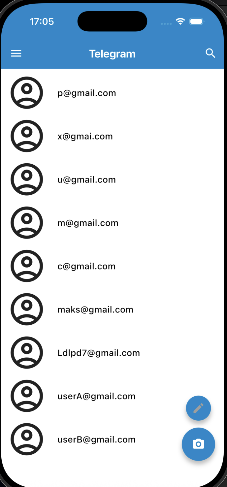
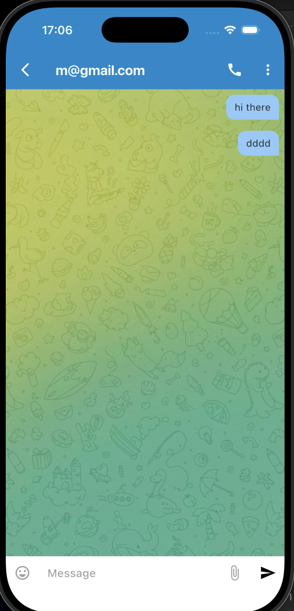
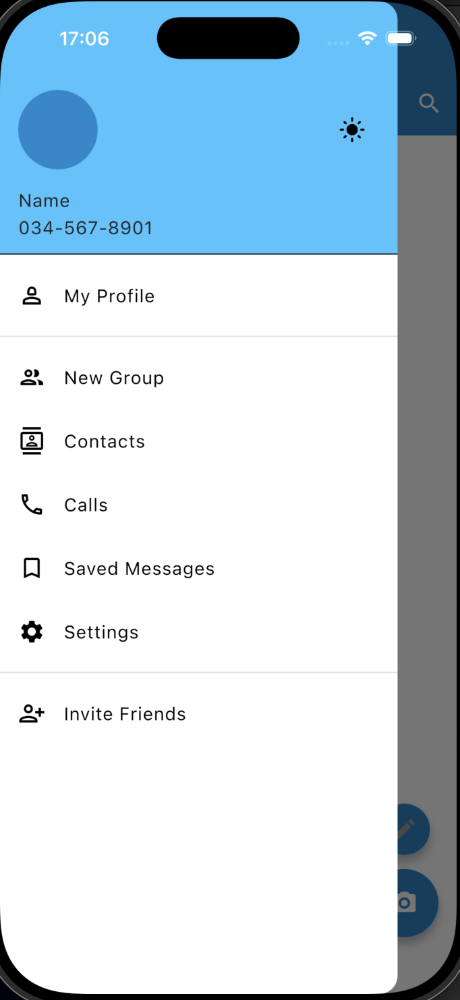

# Telegram Clone - Flutter

A **Telegram clone** built with **Flutter**, showcasing real-time chat UI, authentication, and messaging features. This is a **learning project** to practice Flutter development and UI design.

---

## Features

- Modern chat interface similar to Telegram
- User authentication (login/signup)
- Send and receive messages
- Display profile pictures and chat avatars
- Responsive UI for mobile devices
- Asset-based images for UI elements (profile pics, icons)

---

## Screenshots

Here are some screenshots of the app:

  
  
  


## Getting Started

### 1. Clone the repository

```bash
git clone https://github.com/yourusername/telegramm_app.git
cd telegramm_app